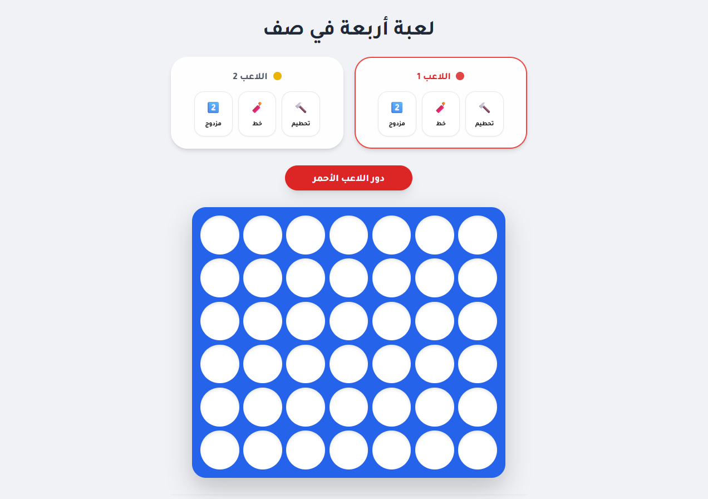

# 4 in a Row Game

A simple browser-based **4 in a Row game** built using HTML, CSS, and JavaScript.  
The game runs directly in the browser with no installation required.

## Play the Game
▶️ **Play here:**  
https://alitaye.github.io/4in-A-Row-Game/

## Preview

## About the Project
This project is a lightweight implementation of the classic **4 in a Row** game.  
It was created as a simple web game and hosted using **GitHub Pages**.

The entire game runs inside a single HTML file, making it easy to understand, modify, and expand.

## Features
- Runs directly in the browser
- Simple and clean interface
- Lightweight implementation
- Easy to modify and extend

## How to Run Locally
1. Download the repository.
2. Open the file:
